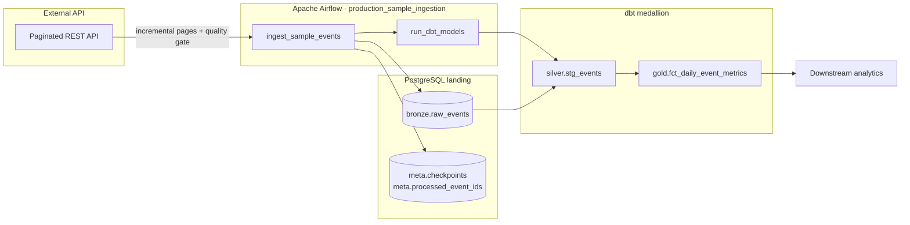

# Production Data Pipeline

> **Incremental ETL pipeline** for API ingestion with checkpointing, PostgreSQL bronze landing, dbt transformations, and Apache Airflow orchestration — a reference implementation for data engineers building reliable cloud data platforms.

[](https://github.com/br413/production-data-pipeline/actions/workflows/ci.yml)
[](https://github.com/br413/production-data-pipeline/releases)
[](https://www.python.org/)
[](https://www.getdbt.com/)
[](https://airflow.apache.org/)
[](LICENSE)

A production-style **data engineering** portfolio project demonstrating incremental API ingestion, idempotent loads, medallion-style layering (bronze → silver → gold), and operational monitoring — patterns used in modern **ETL/ELT pipelines** on cloud data platforms.

## Problem

Operational analytics breaks when pipelines **silently drop records**, re-process duplicates, or push schema drift into dashboards. Teams need a reference pattern that shows:

- How to resume ingestion after interruption without skipping pages or double-counting events
- How to separate raw landing, validated staging, and curated aggregates so each layer is testable
- How to fail loudly when quality regresses — not after bad data reaches executives

This repository is a **production-style reference implementation** for those patterns, not a tutorial CSV load.

## Architecture



**Flow:** paginated API reads with cursor + processed-ID checkpoints → quality-validated bronze landing → dbt silver/gold models with tests → daily aggregates for consumers.

See [`docs/architecture.md`](docs/architecture.md) for component boundaries and failure modes.

## Key decisions

| Decision | Alternatives considered | Why this choice |
|----------|-------------------------|-----------------|
| Cursor + processed-ID checkpoints | Timestamp-only watermarks | APIs can return out-of-order events; stable IDs give safer idempotency |
| PostgreSQL bronze + metadata tables | JSON checkpoints only, SQLite | Matches warehouse/lakehouse landing patterns; DB constraints enforce idempotency |
| dbt for silver/gold transforms | Pure Python transforms | Declarative models, built-in tests, and clearer analytics ownership boundaries |
| Airflow orchestration | Cron, Prefect-only | Widely adopted scheduling model; demonstrates retry/backoff and task dependencies |
| Quality gates before bronze landing | Validate only in dbt | Blocks bad records at the ingestion boundary; reduces polluted raw history |
| File checkpoints for local dev | Require Postgres everywhere | Lowers onboarding friction while keeping a production upgrade path |

Full rationale: [`docs/adr/`](docs/adr/).

## Failure modes

| Failure | Mitigation |
|---------|------------|
| Duplicate delivery | `processed_ids` set + `ON CONFLICT DO NOTHING` on `event_id` |
| Partial page read | Checkpoint advances only after successful page processing |
| API timeout | Airflow retry (2×, 5-min backoff); manual rerun in [`docs/operations.md`](docs/operations.md) |
| Schema drift | Python quality gate blocks landing; dbt tests catch transform issues |
| dbt test failure | DAG stops before downstream consumers see broken data |
| Zero-record “success” | Ingestion metrics + webhook alerts for empty runs |

## Trade-offs

| Area | Choice | Cost accepted |
|------|--------|---------------|
| Checkpoint store | PostgreSQL metadata tables | Requires Docker/local Postgres for integration tests |
| Processed-ID tracking | In-database set per pipeline | Will need pruning/archival at high event volume |
| Landing layer | PostgreSQL bronze | Not object-storage lakehouse scale — intentional scope for clarity |
| Orchestration | Local `airflow dags test` | Production Airflow deployment not included yet |

## Results

Reference implementation metrics (synthetic sample source, CI-validated):

| Signal | Outcome |
|--------|---------|
| Idempotent re-runs | Duplicate events suppressed via processed-ID set and DB constraint |
| Recovery | Checkpoint replay from last successful cursor after process restart |
| Test coverage | pytest across ingestion, quality gates, dbt transforms, and DAG integrity |
| CI | GitHub Actions with PostgreSQL service container on every push and PR |
| Operational docs | Architecture, ADRs, operations runbook, and demo script included |

## Current capabilities

- [x] Incremental ingestion with JSON-file or PostgreSQL checkpoint store
- [x] Idempotent record handling via stable event IDs
- [x] PostgreSQL bronze landing layer with Docker Compose
- [x] Data-quality checks: schema, required fields, uniqueness, freshness
- [x] dbt silver (`stg_events`) and gold (`fct_daily_event_metrics`) models
- [x] Airflow DAG `production_sample_ingestion` with retries
- [x] Ingestion summary metrics and webhook alerts for zero-record runs
- [x] Operations runbook and demo script
- [x] Unit and integration tests with CI PostgreSQL service
- [x] CI workflow on push and pull request
- [x] Failed-record quarantine / dead-letter path ([ADR 0004](docs/adr/0004-failed-record-quarantine.md))
- [ ] Production Airflow deployment (local `airflow dags test` supported)

## Technology stack

| Area | Selection |
|------|-----------|
| Language | Python 3.12 |
| Storage | PostgreSQL bronze + metadata, optional JSON checkpoints |
| Orchestration | Apache Airflow (`production_sample_ingestion`) |
| Transformation | dbt (silver + gold models) |
| Testing | pytest |
| Deployment | Docker Compose (local), CI via GitHub Actions |

## Quick start

```bash
git clone https://github.com/br413/production-data-pipeline.git
cd production-data-pipeline
python -m venv .venv
```

Windows:

```powershell
.\.venv\Scripts\Activate.ps1
pip install -r requirements.txt
pytest
```

Linux/macOS:

```bash
source .venv/bin/activate
pip install -r requirements.txt
pytest
```

Run the sample ingestion (file checkpoints):

```bash
python -m src.pipeline.ingestion --source sample --checkpoint .checkpoints/sample.json
```

Run with PostgreSQL landing and DB checkpoints:

```bash
docker compose up -d
python -m src.pipeline.ingestion --source sample --storage postgres --pipeline-name sample-ingestion
python -m src.pipeline.run_dbt --target dev
```

Run the full demo script (Windows):

```powershell
.\scripts\run_demo.ps1
```

### Full stack demo (with [data-quality-observability](https://github.com/br413/data-quality-observability))

Ingestion and quarantine handle row-level failures; dataset contracts validate landed tables before promote.

Contract pins live in [`config/quality_contracts.yml`](config/quality_contracts.yml) ([ADR 0005](docs/adr/0005-quality-contract-pins.md)):

```yaml
pins:
  orders: orders@1.0
  customers: customers@1.0
```

After postgres ingestion + dbt run:

```bash
cd ../data-quality-observability
python -m src.dqo.cli run --contract orders --data data/samples/orders.csv --references data/samples
python -m src.dqo.cli history --contract orders   # shows v1.0 per run
```

Registry resolution, CI guards, and versioned run history are documented in [dqo ADR 0002](https://github.com/br413/data-quality-observability/blob/main/docs/adr/0002-schema-registry-and-contract-versioning.md).

With quarantine enabled during ingestion:

```bash
python -m src.pipeline.ingestion --source sample --storage postgres --pipeline-name sample-ingestion \
  --enable-quarantine --alert-on-quarantine
```

See [ADR 0004](docs/adr/0004-failed-record-quarantine.md) and the [Data Quality Contracts article](https://dev.to/bobby_ray_581732c715283b2/data-quality-contracts-in-production-pipelines-without-a-separate-platform-team-f3).

## Project structure

```text
.
├── .github/
│   ├── ISSUE_TEMPLATE/
│   ├── workflows/ci.yml
│   └── pull_request_template.md
├── dags/
│   └── production_pipeline_dag.py
├── dbt/
│   ├── models/
│   └── profiles.yml
├── docs/
│   ├── architecture.md
│   ├── demo.md
│   ├── operations.md
│   └── adr/
├── scripts/
│   └── run_demo.ps1
├── src/
│   └── pipeline/
├── tests/
├── docker-compose.yml
├── README.md
├── CONTRIBUTING.md
├── SECURITY.md
└── requirements.txt
```

## Engineering decisions

Architectural Decision Records are stored in [`docs/adr/`](docs/adr/).

## Testing

```bash
pytest -v
```

Coverage includes checkpoint persistence, duplicate suppression, incremental cursor advancement, PostgreSQL landing writes, data-quality validation, dbt transforms, and Airflow DAG integrity.

## Operations

| Concern | Approach |
|---------|----------|
| Scheduling | Airflow DAG `@daily` with 2 retries |
| Monitoring | Ingestion metrics + webhook alerts — see [`docs/operations.md`](docs/operations.md) |
| Retries | Airflow 5-minute backoff; manual rerun documented |
| Backfills | Checkpoint reset with documented procedure |
| Recovery | Checkpoint replay from last successful cursor |
| Secrets | Environment variables; never committed |
| Demo | [`docs/demo.md`](docs/demo.md) walkthrough script |

## Related projects

| Project | Focus |
|---------|-------|
| [**data-quality-observability**](https://github.com/br413/data-quality-observability) | Contract-driven data quality checks with history and alert routing |
| [**cloud-lakehouse-blueprint**](https://github.com/br413/cloud-lakehouse-blueprint) | Medallion lakehouse architecture with Terraform IaC |
| [**Portfolio & writing**](https://br413.github.io/) | Senior DE portfolio and technical articles |
| [**@br413**](https://github.com/br413) | Senior Data Engineer & Data Architect profile |

## Writing

| Article | Topic |
|---------|-------|
| [Building a Production Data Pipeline with Incremental Loading and dbt](https://dev.to/bobby_ray_581732c715283b2/building-a-production-data-pipeline-with-incremental-loading-and-dbt-2e2c) | Incremental checkpoints, idempotent loads, medallion layering, Airflow orchestration |
| [Data Quality Contracts in Production Pipelines](https://dev.to/bobby_ray_581732c715283b2/data-quality-contracts-in-production-pipelines-without-a-separate-platform-team-f3) | Row-level quarantine (v0.2.1), YAML contracts, alert routing — uses this repo |
| [What I Learned Contributing to Prefect, dbt, and Airflow](https://dev.to/bobby_ray_581732c715283b2/what-i-learned-contributing-to-prefect-dbt-and-airflow-an-honest-oss-retrospective-1ki8) | Honest OSS retrospective — upstream merges and building in public |
| [Contract Versioning in Production Pipelines](https://dev.to/bobby_ray_581732c715283b2/contract-versioning-in-production-pipelines-registry-cli-and-run-history-13el) | Registry, CLI, run history, CI guards — ADR 0002 stack |

## Roadmap

Tracked via GitHub Issues and milestones. Week 4 career materials:

- [`docs/career/resume-snippets.md`](docs/career/resume-snippets.md)
- [`docs/career/outreach-tracker.md`](docs/career/outreach-tracker.md)

## Topics

`data-engineering` · `etl` · `elt` · `data-pipeline` · `incremental-loading` · `airflow` · `dbt` · `python` · `postgresql` · `data-platform` · `bronze-silver-gold`

## Attribution

Built as a public portfolio project by [@br413](https://github.com/br413) — Senior Data Engineer & Data Architect. Sample data is synthetic for demonstration.

## License

MIT — see [LICENSE](LICENSE).
